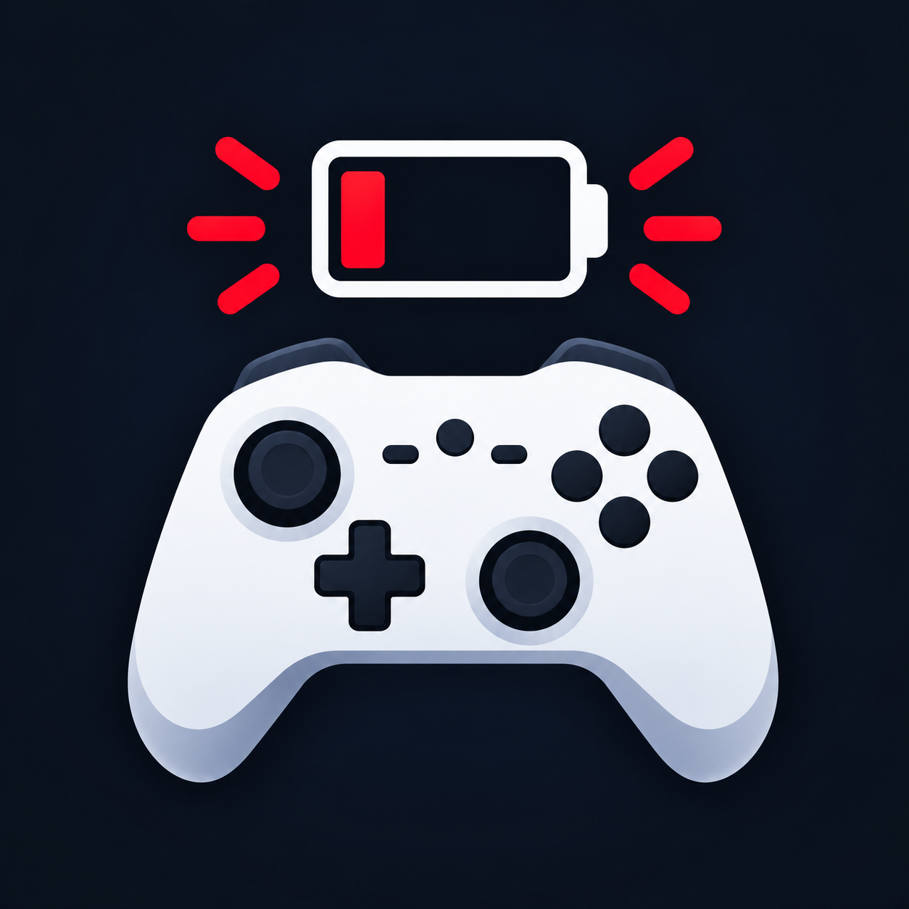

<p align="center">
  
</p>

# Controller Battery Notifier

A tiny, quiet Windows tray app that keeps an eye on the battery level of your Bluetooth game controllers (PlayStation, Xbox, generic BLE gamepads…) and nudges you with a notification **before** the controller dies mid-game.

It lives entirely in the system tray — no taskbar button, no background noise — and renders a live battery icon (color-coded and with a percentage) so you can glance at the charge level at any time.

## Features

- **Live tray icon** — a battery glyph that updates as levels change: green (healthy), yellow (low), red (critical), grey (unknown). Optionally shows the percentage inside the icon.
- **Low-battery notifications** — a Windows toast ("_Controller battery is low — 18%_") when the primary device drops to your configured threshold. Fires once until the level recovers. Tray balloon fallback if toasts are unavailable.
- **Multi-device aware** — monitors every readable controller at once; you pick which one the tray icon and alerts follow ("primary" device, or automatic).
- **Tray flyout** — left-click the icon for a quick panel: refresh, all connected devices with live percentages, and a button to open full settings.
- **Quick menu** — right-click the icon for _Refresh now / Start with Windows / Exit_.
- **Zero footprint** — borderless, glass-styled windows; settings stored in a small JSON file.

## How it works

The app polls two battery sources (every 15 s – 1 hour, configurable):

1. **Bluetooth LE (GATT)** — connects to each paired Bluetooth controller and reads the standard Bluetooth _Battery Service_ (UUID `0x180F`). This is how PlayStation/8BitDo-style wireless controllers report charge. Uses the WinRT GATT API via the .NET 9 SDK (no extra packages).
2. **WMI** — falls back to `BatteryStatus` WMI data for devices that expose a battery through the OS instead of BLE.

Each poll merges both lists, resolves the **primary device** (your selection, or automatically the first controller / first device), and re-renders the tray icon. Live GATT notification subscriptions also push immediate level changes without waiting for the next poll.

## Using the app

After install, look for the battery icon in the system tray (it may be in the overflow area — click the `^` arrow).

| Action                   | What happens                                                                 |
| ------------------------ | ---------------------------------------------------------------------------- |
| **Left-click** the icon  | Flyout pops out: _Refresh_, connected devices with live %, _Settings_ button |
| **Right-click** the icon | Quick menu: _Refresh now_ · _Start with Windows_ · _Exit_                    |
| **Settings** button      | Opens the full settings window                                               |

### Settings

- **Low-battery notification** — on/off + threshold slider (1–99 %, default 20 %).
- **Show percentage in tray icon** — render the number inside the battery glyph.
- **Start with Windows** — register/unregister the app in your logon startup (HKCU `Run` key).
- **Device refresh** — how often battery levels are polled (15 s – 1 hour).
- **Connected devices** — every readable device, with a _Primary_ radio (which one drives the tray icon + alerts), _Refresh now_, and _Send test notification_.

### Getting a controller to appear

1. Pair the controller in Windows Bluetooth settings (as you would for any game).
2. **Wake it** — most controllers only advertise the battery service while connected and awake; press the controller's pairing button once.
3. Press **Refresh** in the flyout (or wait for the next poll).

## Requirements

- **Windows 10 or 11** (64-bit)
- **To install:** nothing — the installer is self-contained (bundles the .NET runtime)
- **To build from source:** [.NET 9 SDK](https://dotnet.microsoft.com/download/dotnet/9.0) (the .NET 9 WinRT projection is what exposes the modern GATT API used here)

## Getting started (from source)

```powershell
# Run the app directly
dotnet run --project src\ControllerBatteryNotifier

# Build
dotnet build src\ControllerBatteryNotifier -c Release
```

### Command-line flags (diagnostics)

| Flag                                        | Description                                                                    |
| ------------------------------------------- | ------------------------------------------------------------------------------ |
| `--list-devices`                            | Lists every device that exposes a readable battery (Bluetooth + WMI) and exits |
| `--render-icon <path.png> [level\|unknown]` | Renders the tray icon to a PNG for visual inspection and exits                 |
| `--debug-flyout`                            | Shows the tray flyout centered on screen (UI debugging)                        |
| `--debug-settings`                          | Opens the settings window on startup (UI debugging)                            |

## Building the installer

The installer is built with [Inno Setup 6](https://jrsoftware.org/isdl.php) from `installer/ControllerBatteryNotifier.iss`.

**Easiest way** — run the build script (publishes and compiles in one go):

```powershell
.\installer\build-installer.ps1
```

Or manually, from the repository root:

```powershell
# 1. Publish a self-contained win-x64 build into the folder the script packages
dotnet publish src\ControllerBatteryNotifier\ControllerBatteryNotifier.csproj `
     -c Release -r win-x64 --self-contained `
     -o installer\publish

# 2. Compile the Inno Setup script
& "$env:LOCALAPPDATA\Programs\Inno Setup 6\ISCC.exe" installer\ControllerBatteryNotifier.iss
#   (or use the Inno Setup IDE: open the .iss and press F9)
```

Result: **`installer/output/Controller Battery Notifier-Setup-<version>.exe`** — a standard Windows installer that offers a Start-menu shortcut and "Start with Windows" auto-launch at install time.

## Project structure

```
├── assets/
│   ├── logo.png                        # app logo (source artwork; shown in this README)
│   └── app.ico                         # multi-size icon (16–256 px) for EXE + installer
├── installer/
│   ├── ControllerBatteryNotifier.iss   # Inno Setup script
│   ├── build-installer.ps1             # one-command build (publish + ISCC)
│   ├── publish/                        # dotnet publish output (generated)
│   └── output/                         # Setup.exe (generated)
└── src/ControllerBatteryNotifier/
    ├── Assets/app.ico                  # app EXE + installer wizard icon (built from assets/logo.png)
    ├── App.xaml / App.xaml.cs          # entry point, tray icon, menu wiring
    ├── FlyoutWindow.xaml(.cs)          # left-click tray flyout
    ├── SettingsWindow.xaml(.cs)        # full settings window
    ├── Views/SettingsPanel.xaml(.cs)   # the settings UI (shared control)
    ├── Models/AppSettings.cs           # user settings (threshold, poll interval…)
    ├── Models/BatteryDevice.cs         # a device with a readable battery
    ├── Services/
    │   ├── BatteryMonitor.cs           # polling, primary device, threshold logic
    │   ├── BluetoothBatterySource.cs   # BLE GATT battery reads (WinRT)
    │   ├── WmiBatterySource.cs         # WMI battery fallback
    │   ├── Notifier.cs                 # toast + balloon notifications
    │   ├── SettingsStore.cs            # JSON persistence
    │   ├── StartupManager.cs           # "Start with Windows" registry toggle
    │   └── IconRenderer.cs             # battery glyph drawing
    └── Theme/Glass.xaml                # shared dark-blue glass theme
```

## Settings file

Persisted as JSON at:

```
%APPDATA%\ControllerBatteryNotifier\settings.json
```

Plain text — safe to edit manually (the app normalizes/validates on load).

## Troubleshooting

| Symptom                    | Fix                                                                                                                                                                                 |
| -------------------------- | ----------------------------------------------------------------------------------------------------------------------------------------------------------------------------------- |
| Controller not listed      | Pair it in Windows, press its pairing button to wake it, then **Refresh**. Some controllers hide the battery service when idle                                                      |
| Tray icon shows "—" (grey) | No readable battery on any device yet — check Bluetooth is on and the controller is connected                                                                                       |
| No toast notification      | Windows may be blocking app notifications: _Settings → System → Notifications → App notifications → Controller Battery Notifier_. The app falls back to tray balloons automatically |
| Icon looks pixelated       | The tray icon is rendered at runtime for the system DPI; if it still looks off, check Windows display scaling (100–150 % is supported)                                              |

## Tech stack

WPF (`.NET 9`, Windows) · WinRT GATT (Bluetooth LE) · WMI · Hardcodet.NotifyIcon.Wpf (tray) · Inno Setup (installer)
